# 🔄 Solana Copy Sniper Trading Bot & MEV Bot - Program Logic Diagram

## 📊 System Architecture Overview

## 🔄 Main Program Flow

```mermaid
flowchart TD
    Start([🚀 Start Bot]) --> Init[Initialize Components]
    Init --> Config[Load Configuration]
    Config --> CheckBalance{Check Wallet Balance}
    
    CheckBalance -->|Sufficient| StartMonitoring[Start Transaction Monitoring]
    CheckBalance -->|Insufficient| AlertLowBalance[Send Low Balance Alert]
    AlertLowBalance --> StopBot[Stop Bot]
    
    StartMonitoring --> MonitorTx[Monitor Blockchain Transactions]
    MonitorTx --> ParseTx[Parse Transaction Data]
    
    ParseTx --> Strategy{Determine Strategy Type}
    
    Strategy -->|Copy Trading| CopyLogic[Copy Trading Logic]
    Strategy -->|Sniper Trading| SniperLogic[Sniper Trading Logic]
    Strategy -->|MEV Opportunity| MEVLogic[MEV Bot Logic]
    
    CopyLogic --> ValidateCopy{Validate Copy Trade}
    SniperLogic --> ValidateSniper{Validate Sniper Trade}
    MEVLogic --> ValidateMEV{Validate MEV Trade}
    
    ValidateCopy -->|Valid| ExecuteCopy[Execute Copy Trade]
    ValidateSniper -->|Valid| ExecuteSniper[Execute Sniper Trade]
    ValidateMEV -->|Valid| ExecuteMEV[Execute MEV Trade]
    
    ValidateCopy -->|Invalid| SkipCopy[Skip Trade]
    ValidateSniper -->|Invalid| SkipSniper[Skip Trade]
    ValidateMEV -->|Invalid| SkipMEV[Skip Trade]
    
    ExecuteCopy --> SwapEngine[Swap Execution Engine]
    ExecuteSniper --> SwapEngine
    ExecuteMEV --> SwapEngine
    
    SwapEngine --> SwapMethod{Select Swap Method}
    
    SwapMethod -->|Solana| StandardSwap[Standard Solana Swap]
    SwapMethod -->|JITO| JitoSwap[JITO Swap]
    SwapMethod -->|Nozomi| NozomiSwap[Nozomi Swap]
    SwapMethod -->|0slot| ZeroSlotSwap[0slot Swap]
    SwapMethod -->|Race| RaceSwap[Race Swap]
    
    StandardSwap --> ExecuteTransaction[Execute Transaction]
    JitoSwap --> ExecuteTransaction
    NozomiSwap --> ExecuteTransaction
    ZeroSlotSwap --> ExecuteTransaction
    RaceSwap --> ExecuteTransaction
    
    ExecuteTransaction --> Success{Transaction Success?}
    
    Success -->|Yes| UpdatePosition[Update Position Tracking]
    Success -->|No| RetryLogic{Retry Count < Max?}
    
    RetryLogic -->|Yes| RetryDelay[Wait & Retry]
    RetryLogic -->|No| LogError[Log Error & Alert]
    
    RetryDelay --> ExecuteTransaction
    LogError --> MonitorTx
    
    UpdatePosition --> SellLogic[Apply Custom Sell Logic]
    SellLogic --> ShouldSell{Should Sell?}
    
    ShouldSell -->|Yes| ExecuteSell[Execute Sell Trade]
    ShouldSell -->|No| ContinueMonitoring[Continue Monitoring]
    
    ExecuteSell --> SwapEngine
    ContinueMonitoring --> MonitorTx
    
    SkipCopy --> MonitorTx
    SkipSniper --> MonitorTx
    SkipMEV --> MonitorTx
```

## 🎯 Copy Trading Logic Flow

```mermaid
flowchart TD
    StartCopy([📋 Copy Trading Start]) --> MonitorTarget[Monitor Target Wallet]
    MonitorTarget --> NewTx{New Transaction?}
    
    NewTx -->|Yes| ParseTargetTx[Parse Target Transaction]
    NewTx -->|No| MonitorTarget
    
    ParseTargetTx --> ValidateTarget{Valid Target Trade?}
    
    ValidateTarget -->|Yes| CalculateCopyAmount[Calculate Copy Amount]
    ValidateTarget -->|No| MonitorTarget
    
    CalculateCopyAmount --> CheckBalanceCopy{Sufficient Balance?}
    
    CheckBalanceCopy -->|Yes| ApplyCopyStrategy[Apply Copy Strategy]
    CheckBalanceCopy -->|No| SkipCopyTrade[Skip Copy Trade]
    
    ApplyCopyStrategy --> ExecuteCopyTrade[Execute Copy Trade]
    ExecuteCopyTrade --> TrackCopyPosition[Track Copy Position]
    
    SkipCopyTrade --> MonitorTarget
    TrackCopyPosition --> MonitorTarget
```

## 🎯 Sniper Trading Logic Flow

```mermaid
flowchart TD
    StartSniper([🎯 Sniper Trading Start]) --> MonitorLaunches[Monitor Token Launches]
    MonitorLaunches --> NewLaunch{New Token Launch?}
    
    NewLaunch -->|Yes| AnalyzeLaunch[Analyze Launch Parameters]
    NewLaunch -->|No| MonitorLaunches
    
    AnalyzeLaunch --> ValidateLaunch{Valid Launch?}
    
    ValidateLaunch -->|Yes| CalculateSnipeAmount[Calculate Snipe Amount]
    ValidateLaunch -->|No| MonitorLaunches
    
    CalculateSnipeAmount --> CheckBalanceSnipe{Sufficient Balance?}
    
    CheckBalanceSnipe -->|Yes| ExecuteSnipe[Execute Snipe Trade]
    CheckBalanceSnipe -->|No| SkipSnipe[Skip Snipe Trade]
    
    ExecuteSnipe --> TrackSnipePosition[Track Snipe Position]
    TrackSnipePosition --> ApplySnipeSellLogic[Apply Snipe Sell Logic]
    
    SkipSnipe --> MonitorLaunches
    ApplySnipeSellLogic --> MonitorLaunches
```

## 💰 MEV Bot Logic Flow

## 🔄 Custom Sell Logic Flow

## 📱 Telegram Bot Control Flow

```mermaid
flowchart TD
    StartTelegram([📱 Telegram Bot Start]) --> ListenCommands[Listen for Commands]
    
    ListenCommands --> Command{Command Received?}
    
    Command -->|/start| ShowMainPanel[Show Main Control Panel]
    Command -->|/status| ShowStatus[Show Bot Status]
    Command -->|/balance| ShowBalance[Show Wallet Balance]
    Command -->|/alerts| ShowAlerts[Show Alert Settings]
    Command -->|/stats| ShowStats[Show Trading Stats]
    Command -->|start_bot| StartBot[Start Trading Bot]
    Command -->|stop_bot| StopBot[Stop Trading Bot]
    
    ShowMainPanel --> UpdateButtons[Update Interactive Buttons]
    ShowStatus --> UpdateButtons
    ShowBalance --> UpdateButtons
    ShowAlerts --> UpdateButtons
    ShowStats --> UpdateButtons
    
    StartBot --> CheckBalanceTelegram{Check Balance}
    CheckBalanceTelegram -->|Sufficient| StartTrading[Start Trading Operations]
    CheckBalanceTelegram -->|Insufficient| SendError[Send Error Message]
    
    StopBot --> StopTrading[Stop Trading Operations]
    
    StartTrading --> ListenCommands
    StopTrading --> ListenCommands
    SendError --> ListenCommands
    UpdateButtons --> ListenCommands
```

## 🔧 Swap Execution Engine Flow

## 📊 Data Flow Architecture

## 🛡️ Error Handling & Recovery

## 📈 Performance Monitoring Flow

```mermaid
flowchart TD
    StartMonitor([📊 Performance Monitoring]) --> CollectMetrics[Collect Trading Metrics]
    
    CollectMetrics --> CalculateStats[Calculate Statistics]
    CalculateStats --> UpdateDashboard[Update Dashboard]
    
    UpdateDashboard --> CheckThresholds{Check Performance Thresholds}
    
    CheckThresholds -->|Below Threshold| TriggerAlert[Trigger Performance Alert]
    CheckThresholds -->|Above Threshold| ContinueMonitoring[Continue Monitoring]
    
    TriggerAlert --> SendNotification[Send Notification]
    SendNotification --> ContinueMonitoring
    
    ContinueMonitoring --> CollectMetrics
```

---

## 🔑 Key Components Summary

### **Core Engines:**
- **Transaction Monitor**: Real-time blockchain monitoring
- **Copy Trading Engine**: Replicate successful trades
- **Sniper Trading Engine**: Fast token launch execution
- **MEV Bot Engine**: Capture arbitrage opportunities
- **Swap Execution Engine**: Multi-method transaction execution

### **Data Processing:**
- **Transaction Parser**: Analyze blockchain transactions
- **Strategy Analyzer**: Determine optimal trading strategies
- **Risk Manager**: Implement safety checks and limits
- **Performance Tracker**: Monitor and optimize performance

### **User Interface:**
- **Telegram Controller**: Remote bot control
- **Alert System**: Real-time notifications
- **Status Dashboard**: Live performance metrics
- **Balance Monitor**: Wallet balance tracking

### **Configuration:**
- **Environment Variables**: System configuration
- **Trading Parameters**: Strategy settings
- **Sell Logic Rules**: Custom exit strategies
- **Alert Settings**: Notification preferences

This comprehensive program logic diagram shows the complete architecture and data flow of your Solana Copy Sniper Trading Bot & MEV Bot, highlighting the key advantages of copy trading, sniper trading, and MEV functionality with customizable sell logic for maximum profit potential. 