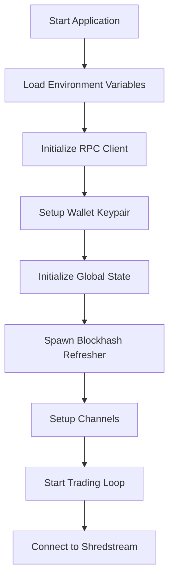
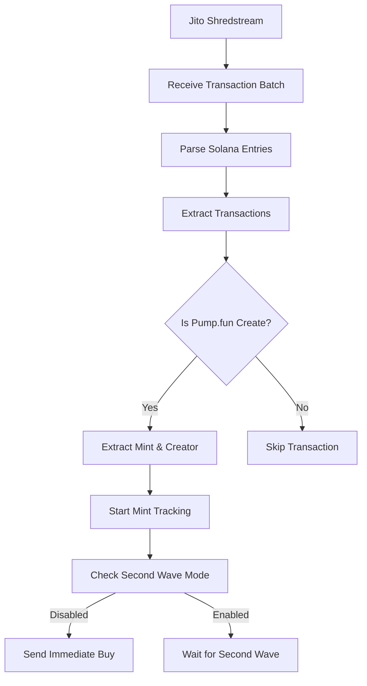
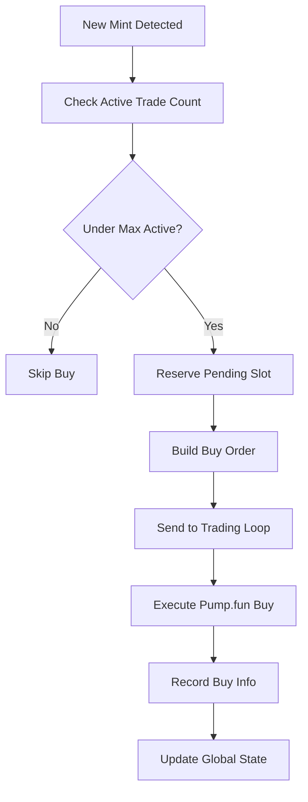
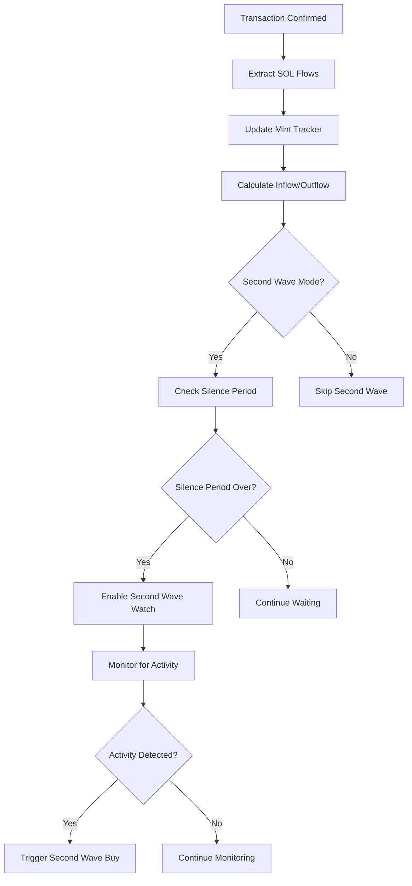
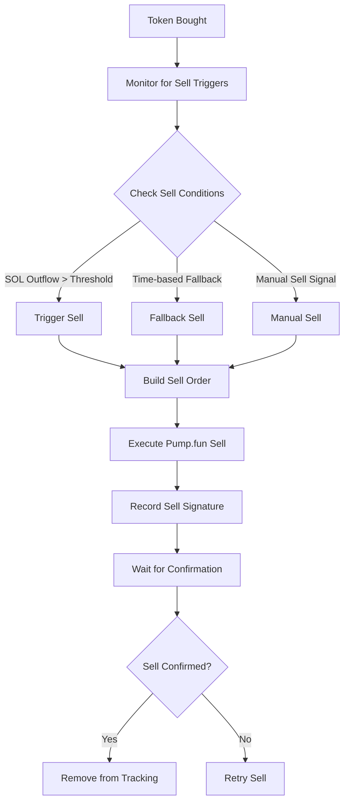

# Shreds Sniper Bot - Program Logic Diagram

## Overview
The Shreds Sniper Bot is a sophisticated Solana MEV (Maximal Extractable Value) trading bot that monitors Pump.fun token launches in real-time and executes automated buy/sell strategies. It uses Jito's shredstream for ultra-low latency transaction monitoring and implements both first-wave and second-wave sniping strategies.

## Architecture Components

### 1. Core Components
```
┌─────────────────────────────────────────────────────────────────┐
│                        MAIN APPLICATION                        │
├─────────────────────────────────────────────────────────────────┤
│  • Environment Configuration (.env)                           │
│  • RPC Client Setup (Solana RPC)                             │
│  • Wallet Management (Keypair)                                │
│  • Global State Management                                    │
└─────────────────────────────────────────────────────────────────┘
```

### 2. Data Flow Architecture
```
┌─────────────────┐    ┌─────────────────┐    ┌─────────────────┐
│   JITO SHRED   │───▶│  TRANSACTION    │───▶│   PUMP.FUN      │
│   STREAM       │    │   PARSER        │    │   DETECTOR      │
└─────────────────┘    └─────────────────┘    └─────────────────┘
         │                       │                       │
         ▼                       ▼                       ▼
┌─────────────────┐    ┌─────────────────┐    ┌─────────────────┐
│   MINT TRACKER  │    │   FLOW ANALYZER │    │   BUY DECISION  │
│   (State Mgmt)  │    │   (SOL In/Out)  │    │   ENGINE        │
└─────────────────┘    └─────────────────┘    └─────────────────┘
         │                       │                       │
         ▼                       ▼                       ▼
┌─────────────────┐    ┌─────────────────┐    ┌─────────────────┐
│   TRADING LOOP  │◀───│   SELL DECISION │◀───│   CONFIRMATION  │
│   (Buy/Sell)    │    │   ENGINE        │    │   TRACKER       │
└─────────────────┘    └─────────────────┘    └─────────────────┘
```

## Detailed Program Logic Flow

### Phase 1: Initialization & Setup


### Phase 2: Transaction Monitoring


### Phase 3: Buy Decision Logic


### Phase 4: Flow Analysis & Second Wave


### Phase 5: Sell Decision Logic


## Key Components Breakdown

### 1. Shredstream Integration
- **Purpose**: Ultra-low latency transaction monitoring
- **Technology**: Jito's gRPC shredstream protocol
- **Function**: Real-time transaction parsing and mint detection

### 2. Mint Tracker
- **State Management**: Tracks each mint's lifecycle
- **Flow Analysis**: Monitors SOL inflow/outflow patterns
- **Second Wave Logic**: Implements silence period and activity detection

### 3. Trading Loop
- **Buy Execution**: Handles Pump.fun buy transactions
- **Sell Execution**: Manages sell orders with retry logic
- **Order Management**: Coordinates between different order types

### 4. Flow Analyzer
- **SOL Flow Tracking**: Monitors bonding curve SOL changes
- **Pattern Detection**: Identifies pump-and-dump patterns
- **Risk Assessment**: Evaluates token viability

### 5. Confirmation System
- **Buy Confirmation**: Tracks successful buy transactions
- **Sell Confirmation**: Monitors sell transaction success
- **Retry Logic**: Handles failed transactions

## Configuration Parameters

### Environment Variables
```
WALLET_PUBKEY              # Trading wallet public key
SHREDSTREAM_URL           # Jito shredstream endpoint
MAX_ACTIVE_TRADES         # Maximum concurrent trades
BUY_AMOUNT_SOL           # SOL amount per buy
SLIPPAGE                 # Slippage tolerance (basis points)
SECOND_WAVE_MODE         # Enable second-wave sniping
SW_SILENCE_SECS          # Silence period duration
MIN_SOL_INFLOW_TRIGGER   # Minimum SOL inflow threshold
MIN_SOL_OUTFLOW_TRIGGER  # Minimum SOL outflow threshold
```

### Trading Parameters
```
- Buy Amount: Configurable SOL per trade
- Slippage: Adjustable tolerance (default 15 bps)
- Max Active Trades: Prevents over-exposure
- Fallback Timeout: Automatic sell after 25 seconds
- Retry Logic: Up to 3 attempts for failed sells
```

## Risk Management Features

### 1. Position Limits
- Maximum active trades limit
- Per-trade SOL amount limits
- Creator share percentage limits

### 2. Time-based Safeguards
- Fallback sell after 25 seconds
- Sell confirmation timeouts
- Retry limits for failed transactions

### 3. Flow-based Risk Assessment
- SOL outflow detection
- Pump-and-dump pattern recognition
- Creator selling detection

## Performance Optimizations

### 1. Latency Optimization
- Jito shredstream for minimal latency
- Non-blocking RPC clients
- Async/await throughout codebase

### 2. State Management
- In-memory tracking with Mutex
- Atomic counters for thread safety
- Efficient data structures

### 3. Transaction Optimization
- Priority fees for urgent transactions
- Jito MEV bundle integration
- Optimized instruction building

## Error Handling & Recovery

### 1. Network Resilience
- Exponential backoff for RPC calls
- Connection retry logic
- Graceful degradation

### 2. Transaction Recovery
- Sell retry mechanism
- Signature tracking
- Confirmation monitoring

### 3. State Recovery
- Persistent state tracking
- Transaction reconciliation
- Cleanup procedures

## Monitoring & Logging

### 1. Transaction Logging
- Buy/sell transaction records
- Flow analysis logs
- Error tracking

### 2. Performance Metrics
- Latency measurements
- Success/failure rates
- Profit/loss tracking

### 3. Debug Information
- Detailed transaction parsing
- State transition logs
- Configuration validation

## Security Considerations

### 1. Private Key Management
- Environment variable storage
- Secure keypair handling
- No hardcoded secrets

### 2. Transaction Security
- Slippage protection
- Amount validation
- Signature verification

### 3. Network Security
- Secure RPC connections
- TLS configuration
- Connection validation

This architecture enables the bot to operate with minimal latency while maintaining robust risk management and error recovery capabilities. The modular design allows for easy configuration and monitoring of different trading strategies. 